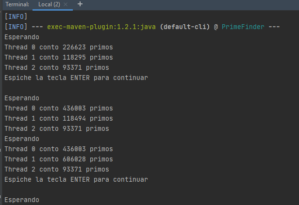
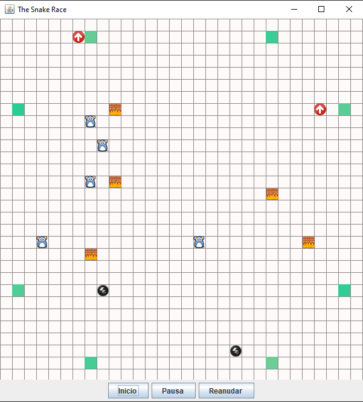
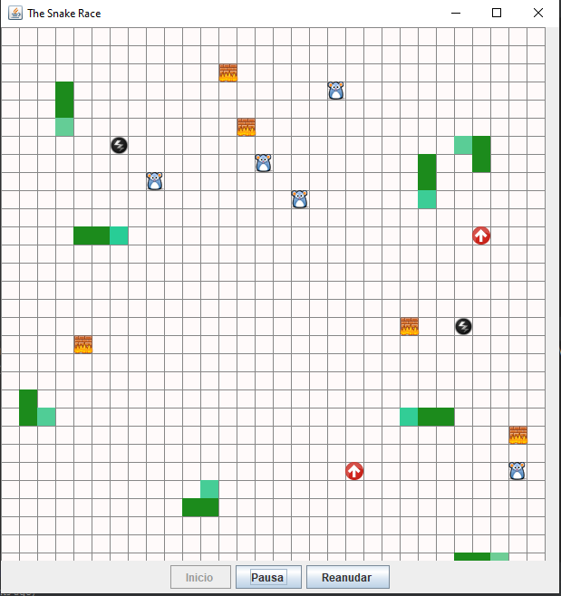

# ARWS_LAB1

## BlackLists
### Primera parte
Part I - Introduction to threads in JAVA
In agreement with the lectures, complete the classes CountThread, so that they define the life cycle of a thread that prints the numbers between A and B on the screen.
Complete the main method of the CountMainThreads class so that: 
Create 3 threads of type CountThread, assigning the first interval [0..99], the second [99..199], and the third [200..299]. 
Start the three threads with start(). Run and check the output on the screen. 
Change the beginning with start() to run(). How does the output change? Why?

_______________________

1. A continuacion podemos observar la diferencia entre el .run() y el .start()
  al extender la clase thread podemos usar los metodos tanto como run y start 
  pero al implementar Runnable nos damos cuenta de que debemos sobre cargar el metodo .start
  para iniciar el hilo a diferencia del extend ya que se herada el thread y podemos 
  usar sus metodos.
  
*****************************

2. Al usar el Start nos damos cuenta que inicia el hilo y luego de haber iniciado , es ir y ejecutar lo que tenga el metodo run() en este caso imprimir entre un rango a y b
  
_______________________

3. Usamos el run y nos damos cuenta que como no se inicia el hilo , ejecuta secuencialmente el metodo run y mostrara en orden los rangos de acuerdo como se coloquen en el main

  
  
### Cuarta Parte
1. A continuacion podemos ver con ayuda de visuamVM como al usar un solo thread hace uso del procesador y cuanto tiempo demora en hacer la ejecucion de todos los host para encontrar la ip

2. En este caso usaremos 4 threads que son el numero de nucelos que tiene mi procesador 

3. Ahora usaremos 8 threads que son los hilos que tiene mi procesador 

4.Para la ejecucion de 50 y 100 hilos la ejecucion es muy rapida y el visuamVM no alcanza a detectar el rendimiento de la CPU

5.La respuesta sera la sieguiente en los anteriores ejemplos ya que es la misma ip

___________________________

6. En la siugiente imagen podemos observar como aumentando el numero de threads disminuye el tiempo de ejecucuion de el prograama haciendo que entre mas threads el tiempo tienda ir a cero

## SNAKE
### Primera parte

Control threads using wait/notify.

1. Download the project PrimeFinder. this is a program that calculates prime numbers beetween 0 and M (Control.MAXVALUE),concurrently, distributing the searching of them between n (Control.NTHREADS) independent threads.

2. Modify the application in such way that each t milliseconds of thread execution, all the threads stop and show the number of primes found until that moment. Then, you have to wait until press ENTER in order to resume the threads execution.Use the synchronization mechanisms given by java (wait y notify, notifyAll)  

Vemos que antes de pedirnos el ENTER si alcanso a hacer a algun cambio en algun thread antes de que hiciera wait en todos nos lo mostrara.

### Segunda parte

SnakeRace is an autonomous version, multi-snake of the famous game called 'snake' based on the Joao Andrade´s project-this exercise is a fork thereof

+ N snakes works as an autonomous way.
+ The collision concept does not exists among them. The only way that they die is by crashing against a wall
+ There are mice distributed along the game. As in the classic game, each time a snake eats  a mouse, it grows
+ There are some points (red arrows) that teleport the snakes the rays causes that the snake increase its speed

### Tercer parte

1. Analyse the code in order to understand how the threads are being used to create an autonomous behavior in the N snakes
2. Accordingly, and using the game logic, identify and write clearly (ANSWERS.txt file)
      + Possible race conditions
      + An incorrect or inappropriate use of collections, considering its concurrent handling(For this increase the game speed and execute it multiples times until an error has         been raised).
      + Unnecessary use of active waits
NOTA: Estas respues se encuentran [aquí](https://github.com/JuanManuelHerreraMoya/ARWS_LAB1/blob/master/ANSWERS) o en el archivo ASNWERS.txt que esta al principio.
3. Identify critical regions associated with race conditions, and do something in order to eliminate them.Note that you have to synchronize strictly needed. In the answers document suggest the solution proposed for each item of the point 2. As the same way note that you don´t have to add more race conditions
4. As you can see, the game is incomplete. Write code in order to implement functionallities through buttons in the GUI to start / Pause / Resume the game: start the game if it has not started, Pause the game if it is on, Resume the game if it is suspended. Keep in mind:
    + When the game has been paused, in some point of the screen you have to show 
        1. the longest snake
        2. The worst snake:(the first snake  dead)
Remember that the pause of the snakes are not instantanious, and you have to guarantee that all the information showed is consistent
Actualmente el juego se veia asi antes de iniciar.

Y se veia asi al ser pausado, lastimosamente no se pudo complir con la condicion de que solo apareciera la primera en ser eliminada yla mas larga, posteriormente
se podra reanudar el juego.

