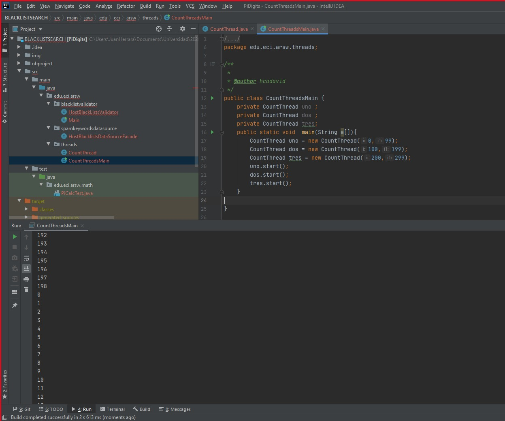
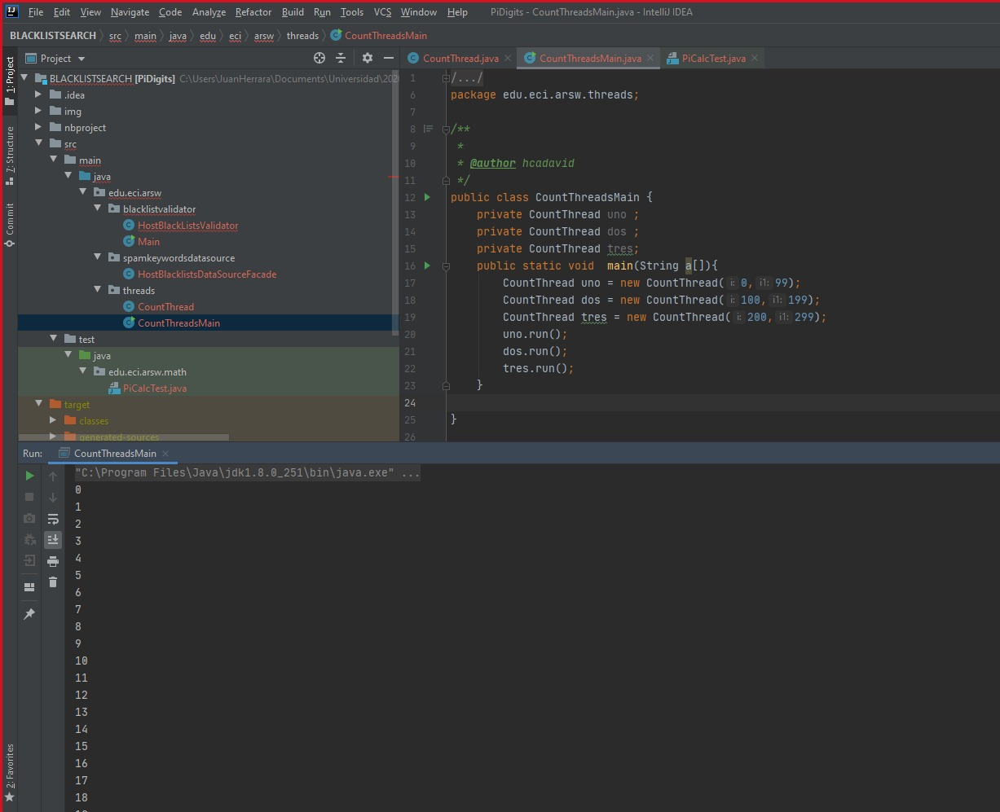
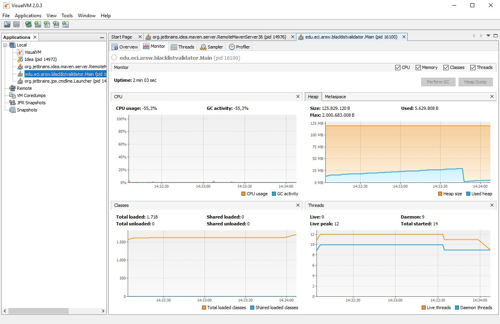
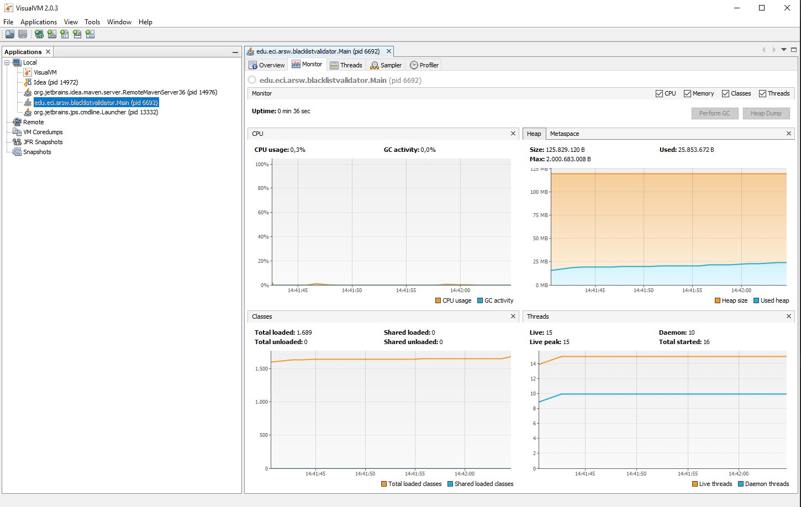
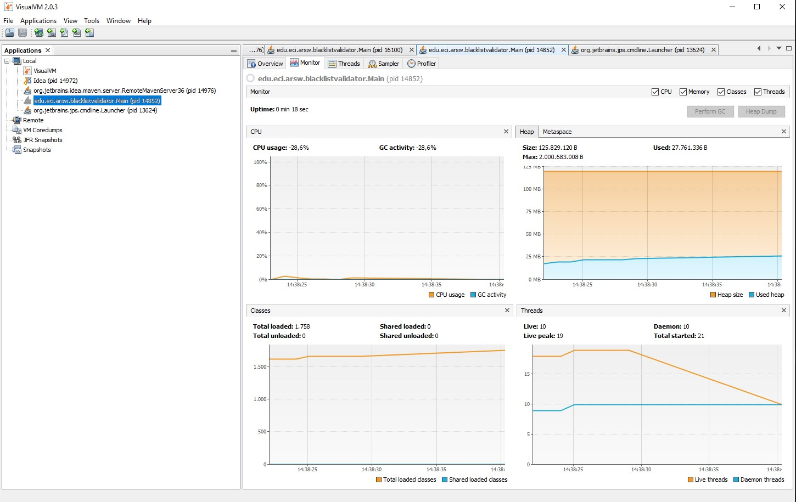
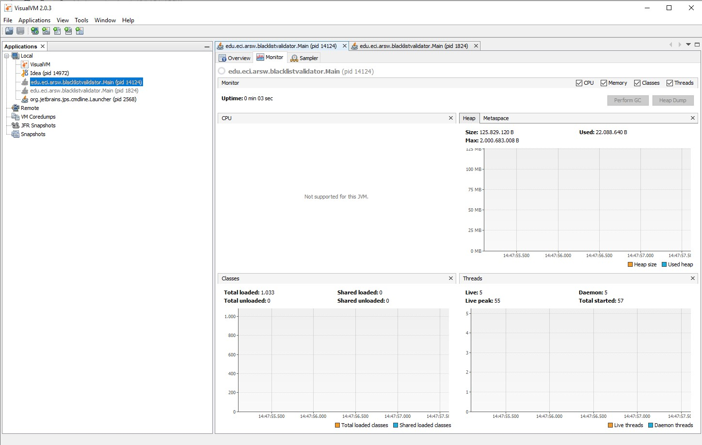
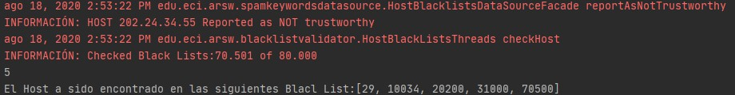
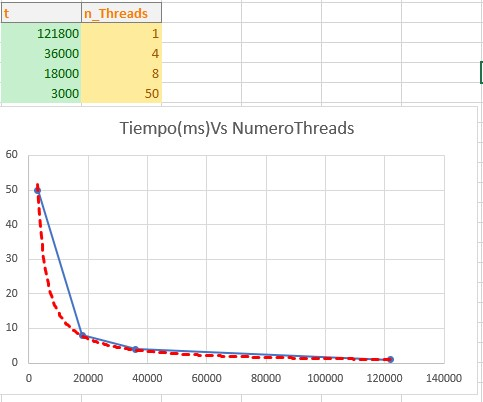

# ARWS_LAB1

## BlackLists
### Primera parte
Part I - Introduction to threads in JAVA
In agreement with the lectures, complete the classes CountThread, so that they define the life cycle of a thread that prints the numbers between A and B on the screen.
Complete the main method of the CountMainThreads class so that: 
Create 3 threads of type CountThread, assigning the first interval [0..99], the second [99..199], and the third [200..299]. 
Start the three threads with start(). Run and check the output on the screen. 
Change the beginning with start() to run(). How does the output change? Why?

_______________________

1. A continuacion podemos observar la diferencia entre el .run() y el .start()
  al extender la clase thread podemos usar los metodos tanto como run y start 
  pero al implementar Runnable nos damos cuenta de que debemos sobre cargar el metodo .start
  para iniciar el hilo a diferencia del extend ya que se herada el thread y podemos 
  usar sus metodos.
  
*****************************

2. Al usar el Start nos damos cuenta que inicia el hilo y luego de haber iniciado , es ir y ejecutar lo que tenga el metodo run() en este caso imprimir entre un rango a y b
  
_______________________

3. Usamos el run y nos damos cuenta que como no se inicia el hilo , ejecuta secuencialmente el metodo run y mostrara en orden los rangos de acuerdo como se coloquen en el main

  
  
### Cuarta Parte
1. A continuacion podemos ver con ayuda de visuamVM como al usar un solo thread hace uso del procesador y cuanto tiempo demora en hacer la ejecucion de todos los host para encontrar la ip

2. En este caso usaremos 4 threads que son el numero de nucelos que tiene mi procesador 

3. Ahora usaremos 8 threads que son los hilos que tiene mi procesador 

4.Para la ejecucion de 50 y 100 hilos la ejecucion es muy rapida y el visuamVM no alcanza a detectar el rendimiento de la CPU

5.La respuesta sera la sieguiente en los anteriores ejemplos ya que es la misma ip

___________________________

6. En la siugiente imagen podemos observar como aumentando el numero de threads disminuye el tiempo de ejecucuion de el prograama haciendo que entre mas threads el tiempo tienda ir a cero

La ley de Amdahl es utilizada para averiguar la mejora máxima de un sistema de información cuando solo una parte de éste es mejorado, en nuestro laboratorio de Balck list nos podemos dar cuenta como se ve efectuada esta ley ya que , teniendo 1 nucelo teniendo 4 y teniendo 8 nucleos, se ven como el rendimiento va aumentando y se demora menos tiempo de ejecucion , pero despues de aumentar los nucleos que tiene el pc , ya sean 8 o 16 o 32, el tiempo de ejecucion es minimo en cuanto a diferencias , ya que gracias a la ley podemos desmotrar que no hay mas rendimiento teniendo 200 threads a tener 500 threads , claro que se vera afectado , pero en milisegundo o aun menos.
